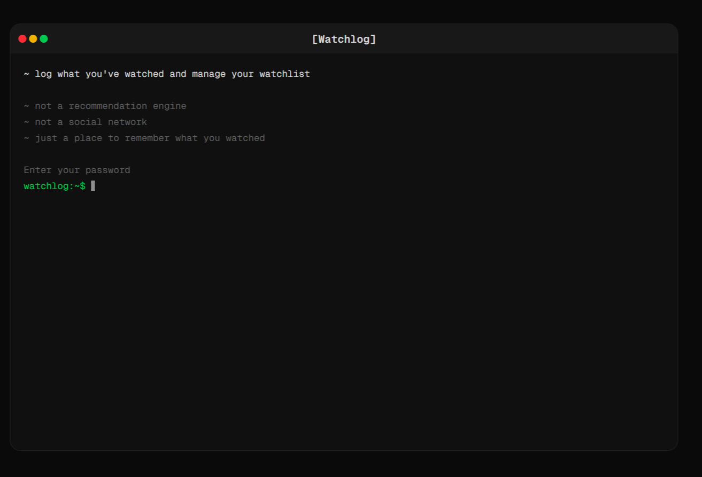
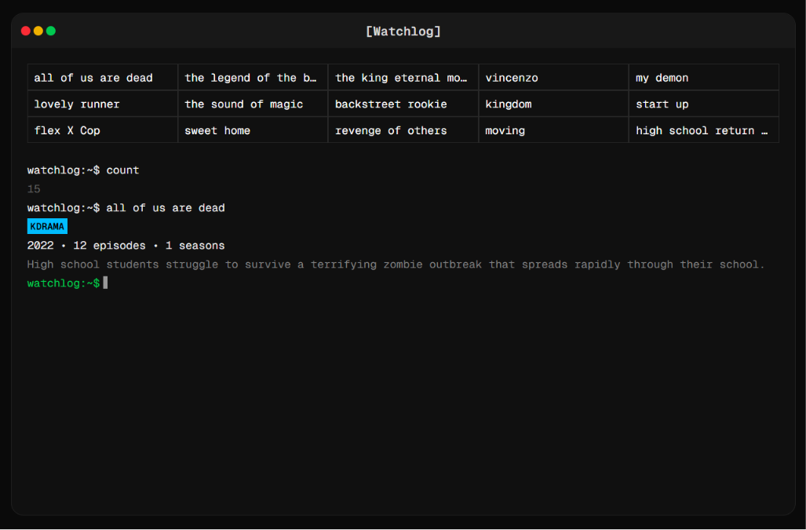

# Watchlog v1.0.0
> this is a terminal like ui for managing my wathclogs

## About

Watchlog is a personal project that I built to keep track of everything I watch. Instead of using a traditional interface, it provides a minimal terminal-like experience that makes logging and browsing media feel more interactive.

This project is built purely for my own use and serves as both a watch tracker and a fun UI experiment.

## Features

- 🎬 Maintain a personal watch log
- 📋 Keep track of my watchlist
- 💻 Terminal-inspired interface
- ⚡ Minimal and keyboard-friendly experience

## 📸 Screenshots

### Home screen

  

### Watchlog screen

  

## Motivation

I wanted a simple, distraction-free way to manage my watch history while experimenting with a terminal-style web interface.

## Status

This is a personal project and is continuously updated whenever I feel like adding new features or improving the experience.

## License

This repository is intended for personal use.